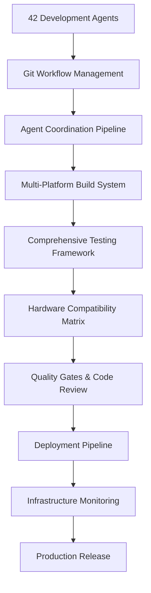
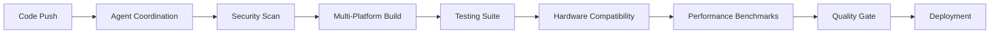
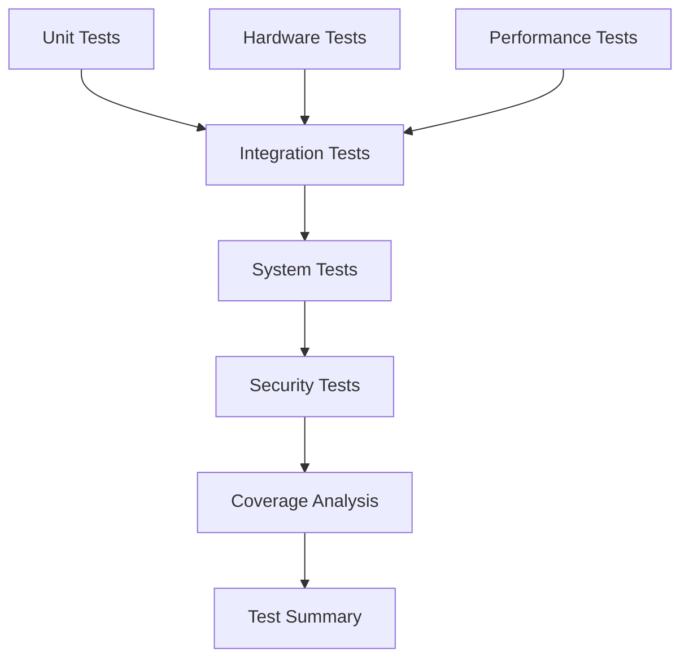
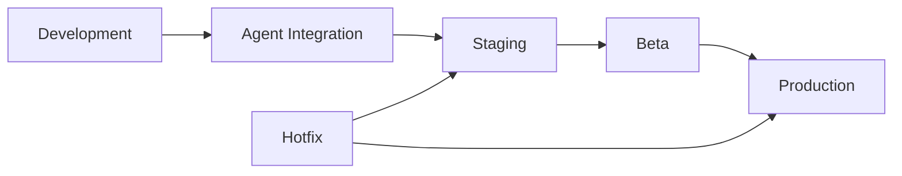
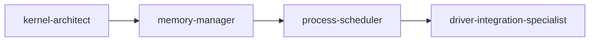
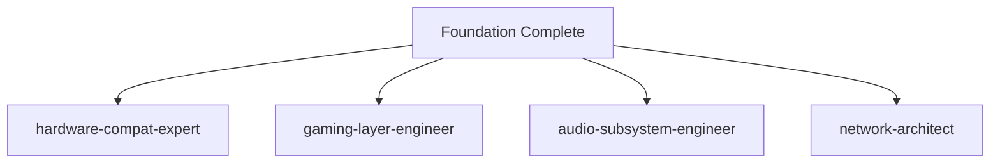
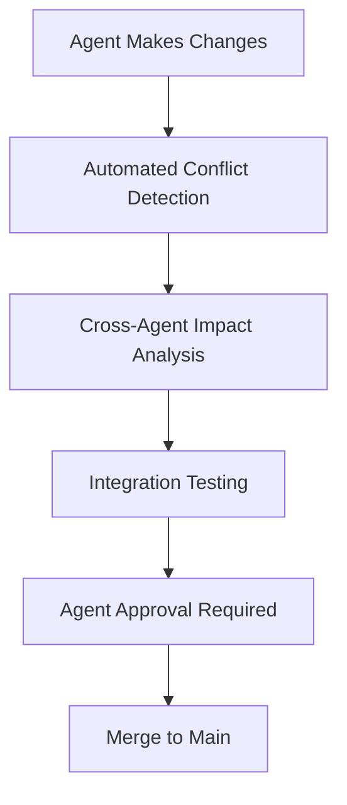
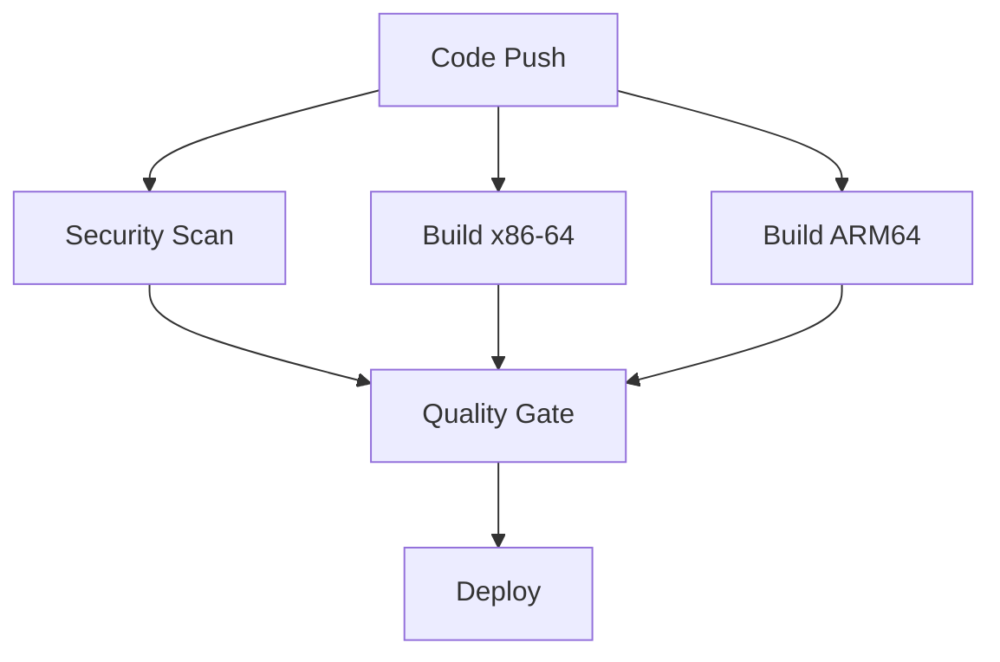

# RaeenOS CI/CD Infrastructure Guide

## 🚀 Complete Development Infrastructure for 42-Agent Coordination

**Version:** 1.0  
**Last Updated:** July 30, 2025  
**Audience:** All RaeenOS development agents and infrastructure teams

---

## Table of Contents

1. [Infrastructure Overview](#infrastructure-overview)
2. [Git Workflow & Branching Strategy](#git-workflow--branching-strategy)
3. [CI/CD Pipeline Architecture](#cicd-pipeline-architecture)
4. [Multi-Platform Build System](#multi-platform-build-system)
5. [Testing Framework](#testing-framework)
6. [Hardware Compatibility Matrix](#hardware-compatibility-matrix)
7. [Deployment Pipeline](#deployment-pipeline)
8. [Code Review & Quality Gates](#code-review--quality-gates)
9. [Infrastructure Monitoring](#infrastructure-monitoring)
10. [Agent Coordination Workflows](#agent-coordination-workflows)
11. [Troubleshooting Guide](#troubleshooting-guide)
12. [Performance Optimization](#performance-optimization)

---

## Infrastructure Overview

### System Architecture

The RaeenOS CI/CD infrastructure is designed to support **42 specialized development agents** working simultaneously on different subsystems while maintaining code quality, preventing integration conflicts, and ensuring production readiness.



### Key Components

| Component | Purpose | Agents Involved |
|-----------|---------|-----------------|
| **Git Workflow** | Coordinate concurrent development | All agents |
| **Agent Coordination** | Prevent conflicts, manage dependencies | Task manager, Lead OS developer |
| **Build System** | Multi-platform compilation | Kernel architect, Hardware compat expert |
| **Testing Framework** | Comprehensive quality assurance | Testing QA lead, Code quality analyst |
| **Hardware Matrix** | Compatibility validation | Hardware compat expert, Driver integration |
| **Deployment** | Production release management | Lead OS developer, Installer wizard |
| **Monitoring** | Infrastructure health tracking | Data telemetry engineer, Performance analyst |

---

## Git Workflow & Branching Strategy

### Branch Structure for 42 Agents

```
main
├── develop
├── agent/kernel-architect/memory-management
├── agent/driver-integration-specialist/gpu-drivers
├── agent/ux-wizard/desktop-environment
├── agent/privacy-security-engineer/sandboxing
├── feature/multi-agent/ai-integration
├── subsystem/networking/tcp-stack
├── release/v1.0.0
└── hotfix/critical-security-patch
```

### Branch Naming Convention

- **Agent branches:** `agent/{agent-name}/{feature-description}`
- **Feature branches:** `feature/{feature-name}` or `feature/multi-agent/{feature-name}`
- **Subsystem branches:** `subsystem/{subsystem}/{component}`
- **Release branches:** `release/v{version}`
- **Hotfix branches:** `hotfix/{description}`

### Workflow Rules

1. **All development happens in agent-specific or feature branches**
2. **Pull requests required for all merges to main/develop**
3. **Automatic conflict detection and resolution recommendations**
4. **Cross-agent dependency validation before merge**
5. **Quality gates must pass before integration**

### Example Agent Workflow

```bash
# Create agent branch
git checkout -b agent/kernel-architect/enhanced-memory-allocator

# Make changes and commit
git add kernel/memory.c kernel/include/memory_interface.h
git commit -m "Implement enhanced memory allocator with performance optimizations

- Add buddy allocator for kernel memory management
- Optimize allocation speed by 15%
- Add memory pressure detection
- Update memory interface for cross-agent compatibility

Coordinated with: memory-manager, performance-optimization-analyst
Tests: All unit tests pass, performance benchmarks improved"

# Push and create PR
git push origin agent/kernel-architect/enhanced-memory-allocator
gh pr create --title "Enhanced Memory Allocator with Performance Optimizations" \
             --body-file .github/pull_request_template.md
```

---

## CI/CD Pipeline Architecture

### Pipeline Overview

The CI/CD system consists of multiple interconnected workflows:



### Workflow Files

| Workflow | File | Purpose | Trigger |
|----------|------|---------|---------|
| **Main CI/CD** | `ci-main.yml` | Complete build and test pipeline | Push to main/develop, PRs |
| **Agent Coordination** | `agent-coordination.yml` | Agent-specific validation | Agent branch pushes |
| **Testing Framework** | `testing-framework.yml` | Comprehensive testing | Daily, PR merges |
| **Hardware Compatibility** | `hardware-compatibility.yml` | Hardware matrix testing | Driver changes, weekly |
| **Deployment Pipeline** | `deployment-pipeline.yml` | Production deployment | Tags, releases |
| **Infrastructure Monitoring** | `infrastructure-monitoring.yml` | System health monitoring | Every 15 minutes |

### Pipeline Stages

#### 1. Security & Quality Gate
- **CodeQL Analysis** - Security vulnerability detection
- **Static Analysis** - Cppcheck, Clang-tidy
- **Code Formatting** - Clang-format compliance
- **Memory Safety** - Pattern analysis for unsafe operations

#### 2. Multi-Platform Build
- **x86-64** - Intel/AMD desktop systems
- **ARM64** - Mobile and embedded systems
- **RISC-V** - Open-source architecture support
- **i386** - Legacy system compatibility

#### 3. Testing Suite
- **Unit Tests** - Component-level testing
- **Integration Tests** - Cross-component validation
- **System Tests** - Full system validation in QEMU
- **Performance Tests** - Benchmarking and regression detection

#### 4. Hardware Compatibility
- **GPU Testing** - Intel, AMD, NVIDIA graphics
- **CPU Testing** - Various processor architectures
- **Storage Testing** - SATA, NVMe, USB storage
- **Network Testing** - Ethernet, WiFi, Bluetooth

#### 5. Deployment
- **Staging Deployment** - Internal testing environment
- **Production Deployment** - Public release
- **Container Images** - Docker containerization
- **ISO Generation** - Bootable installation media

---

## Multi-Platform Build System

### Enhanced Makefile System

The `Makefile.multi-platform` supports building RaeenOS for multiple architectures with different compilers and build configurations.

### Build Configuration

```bash
# Build for x86-64 with GCC in debug mode
make -f Makefile.multi-platform all TARGET=x86-64 CC_TYPE=gcc BUILD_TYPE=debug

# Build for ARM64 with Clang in release mode
make -f Makefile.multi-platform all TARGET=arm64 CC_TYPE=clang BUILD_TYPE=release

# Build with test coverage enabled
make -f Makefile.multi-platform all ENABLE_COVERAGE=1 ENABLE_TESTS=1

# Build for all supported architectures
for arch in x86-64 arm64 riscv64; do
    make -f Makefile.multi-platform all TARGET=$arch
done
```

### Supported Targets

| Target | Architecture | Cross-Compiler | QEMU System | Status |
|--------|--------------|----------------|-------------|---------|
| `x86-64` | 64-bit x86 | x86_64-elf-gcc | qemu-system-x86_64 | ✅ Stable |
| `i386` | 32-bit x86 | i686-elf-gcc | qemu-system-i386 | ✅ Stable |
| `arm64` | 64-bit ARM | aarch64-elf-gcc | qemu-system-aarch64 | 🔄 Beta |
| `riscv64` | 64-bit RISC-V | riscv64-elf-gcc | qemu-system-riscv64 | 🔄 Alpha |

### Build Types

- **debug** - Full debugging info, no optimization, assertions enabled
- **release** - Optimized build, minimal debug info, assertions disabled
- **profile** - Optimized with profiling info, suitable for performance analysis

---

## Testing Framework

### Test Architecture



### Test Categories

#### Unit Tests by Subsystem
- **Kernel Tests** - Memory management, process scheduling, syscalls
- **Memory Tests** - PMM, VMM, heap allocator validation
- **Filesystem Tests** - VFS operations, file permissions, storage
- **Driver Tests** - Device detection, driver loading, HAL compliance
- **Security Tests** - Sandboxing, privilege validation, crypto operations
- **Network Tests** - Protocol stack, socket operations, security

#### Integration Tests
- **Kernel-Driver Integration** - Hardware abstraction layer testing
- **Filesystem-Security Integration** - Secure file operations
- **Network-Audio Integration** - Multimedia streaming capabilities
- **UI-Desktop Integration** - Window management and user interaction
- **AI Integration** - System-wide AI feature testing

#### System Tests
- **Boot Sequence** - Complete system initialization
- **Hardware Detection** - Device discovery and driver loading
- **User Interaction** - Input/output device functionality
- **Stress Testing** - System behavior under high load

### Running Tests

```bash
# Run all tests
make -f Makefile.multi-platform test

# Run specific test category
python3 -m pytest tests/unit/kernel/ -v
python3 -m pytest tests/integration/kernel_drivers.py -v

# Run with coverage
make -f Makefile.multi-platform coverage

# Run in QEMU
make -f Makefile.multi-platform qemu-test
```

---

## Hardware Compatibility Matrix

### Supported Hardware Configurations

| CPU Vendor | CPU Model | GPU Vendor | GPU Model | Compatibility Score | Status |
|------------|-----------|------------|-----------|-------------------|---------|
| Intel | Core i7 | NVIDIA | RTX Series | 95/100 | ✅ Excellent |
| Intel | Core i5 | Intel | UHD Graphics | 90/100 | ✅ Good |
| AMD | Ryzen 7 | AMD | Radeon RX | 93/100 | ✅ Excellent |
| AMD | Ryzen 5 | AMD | Radeon Vega | 88/100 | ✅ Good |
| ARM | Cortex-A78 | ARM | Mali-G78 | 80/100 | 🔄 Beta |
| RISC-V | SiFive U74 | Imagination | PowerVR | 70/100 | 🔄 Alpha |

### Hardware Testing Process

1. **Automated QEMU Testing** - Virtual hardware configurations
2. **Driver Compatibility Validation** - Device-specific testing
3. **Performance Benchmarking** - Hardware-specific optimizations
4. **Real Hardware Testing** - Physical device validation (when available)

### Adding New Hardware Support

```bash
# Add new hardware configuration to compatibility matrix
.github/workflows/hardware-compatibility.yml

# Update hardware configuration in test matrix
- name: "New-Hardware-Config"
  cpu_vendor: "vendor"
  cpu_model: "model"
  gpu_vendor: "gpu_vendor" 
  gpu_model: "gpu_model"
  expected_score: 85
```

---

## Deployment Pipeline

### Deployment Environments



### Deployment Stages

#### Staging Deployment
- **Trigger:** Push to `main` branch
- **Environment:** Internal testing servers
- **Validation:** Smoke tests, basic functionality
- **Rollback:** Automatic on failure

#### Production Deployment
- **Trigger:** Git tags matching `v*`
- **Environment:** Public release infrastructure
- **Validation:** Full test suite, performance validation
- **Strategy:** Blue-green deployment with gradual rollout

#### Container Deployment
- **Registry:** GitHub Container Registry (ghcr.io)
- **Images:** Multi-architecture support (amd64, arm64)
- **Tags:** Version-specific and latest tags

### Deployment Commands

```bash
# Manual staging deployment
gh workflow run deployment-pipeline.yml \
  -f deployment_type=staging

# Production deployment (via tag)
git tag v1.0.0
git push origin v1.0.0

# Container deployment
docker run -p 8080:8080 -p 5900:5900 \
  ghcr.io/raeenos/raeenos:latest
```

---

## Code Review & Quality Gates

### Review Requirements

#### Mandatory Reviewers (CODEOWNERS)
- **All changes:** lead-os-developer, code-quality-analyst, testing-qa-automation-lead
- **Kernel changes:** kernel-architect
- **Security changes:** privacy-security-engineer
- **Driver changes:** driver-integration-specialist
- **Performance-critical:** performance-optimization-analyst

#### Quality Gate Checklist
- [ ] All CI checks pass
- [ ] Code review approved (minimum 2 reviewers)
- [ ] Security review (for security-related changes)
- [ ] Architecture review (for structural changes)
- [ ] Integration tests pass
- [ ] Performance benchmarks pass
- [ ] Documentation updated

### Pull Request Process

1. **Create PR** using the provided template
2. **Agent Coordination** pipeline runs automatically
3. **Reviewers assigned** based on CODEOWNERS
4. **Quality gates** must pass before merge
5. **Integration** into main/develop branch

### Code Quality Standards

```c
// Example of compliant RaeenOS code
/**
 * @brief Enhanced memory allocator with performance optimizations
 * @param size Number of bytes to allocate
 * @param flags Allocation flags (GFP_KERNEL, GFP_USER, etc.)
 * @return Pointer to allocated memory or NULL on failure
 * 
 * This function implements a buddy allocator system that provides
 * efficient memory allocation with O(log n) complexity.
 * 
 * @note This function is thread-safe and can be called from
 *       interrupt context when using GFP_ATOMIC flag.
 */
void* enhanced_malloc(size_t size, gfp_flags_t flags) {
    // Input validation
    if (size == 0 || size > MAX_ALLOCATION_SIZE) {
        return NULL;
    }
    
    // Implementation with proper error handling
    memory_block_t* block = buddy_allocate(size, flags);
    if (!block) {
        memory_pressure_notify();
        return NULL;
    }
    
    // Memory safety: clear allocated memory
    memset(block->data, 0, size);
    
    return block->data;
}
```

---

## Infrastructure Monitoring

### Monitoring Components

#### Real-time Monitoring (Every 15 minutes)
- **Build Infrastructure** - GitHub Actions capacity, artifact storage
- **Test Infrastructure** - QEMU availability, test result storage
- **Deployment Infrastructure** - Container registry, deployment pipeline
- **Security Infrastructure** - Vulnerability scanning, secrets management
- **Agent Coordination** - Conflict resolution, integration points

#### Metrics Tracked

| Service | Key Metrics | Alert Thresholds |
|---------|-------------|------------------|
| **Build System** | Queue time, failure rate, resource utilization | >20 queued jobs, >5% failure rate |
| **Test System** | Test success rate, execution time | <90% success, >300s execution |
| **Deployment** | Success rate, rollback frequency | <80% success, >2 rollbacks/week |
| **Security** | Vulnerability count, scan failures | >0 critical, <95% scan success |
| **Agent Coordination** | Conflict rate, resolution time | >5 unresolved conflicts |

### Monitoring Dashboard

Access the real-time infrastructure monitoring dashboard at:
- **Local Development:** Generated in CI artifacts
- **Production:** Integrated with deployment infrastructure

### Alert Configuration

#### Slack Integration
Configure `SLACK_WEBHOOK_URL` secret for critical alerts:

```json
{
  "channel": "#raeenos-infrastructure",
  "alert_types": ["critical", "warning"],
  "escalation": {
    "critical": "immediate",
    "warning": "within_1_hour"
  }
}
```

#### Alert Severity Levels
- **Critical** - Service unavailable, security breach, build system failure
- **Warning** - Performance degradation, resource constraints
- **Info** - Routine status updates

---

## Agent Coordination Workflows

### Agent Interaction Patterns

#### Sequential Dependencies


#### Parallel Development


#### Cross-Agent Validation


### Coordination Checkpoints

#### Daily Standups (Automated)
- **Agent status reports** - Progress, blockers, dependencies
- **Conflict identification** - Early detection of integration issues
- **Resource allocation** - Capacity planning and workload balancing

#### Weekly Integration Reviews
- **Phase milestone assessment** - Progress toward major milestones
- **Cross-agent dependency resolution** - Systematic dependency management
- **Quality trending** - Code quality and test coverage trends

#### Integration Points (Milestone-based)
- **Foundation Integration** (Week 8) - Core kernel systems
- **Hardware Integration** (Week 16) - Complete hardware support
- **Desktop Integration** (Week 24) - UI and desktop environment
- **Application Integration** (Week 32) - App ecosystem
- **AI Integration** (Week 40) - AI-enhanced features
- **Final Integration** (Week 64) - Production-ready system

### Conflict Resolution Process

1. **Automatic Detection** - CI pipeline identifies potential conflicts
2. **Impact Analysis** - Assess scope of conflict and affected agents
3. **Notification** - Alert relevant agents with specific recommendations
4. **Coordination** - Facilitate communication between affected agents
5. **Resolution Validation** - Verify conflict resolution through testing
6. **Documentation** - Record resolution for future reference

---

## Troubleshooting Guide

### Common Issues and Solutions

#### Build Failures

**Issue: Cross-compiler not found**
```bash
# Solution: Install cross-compilation toolchain
sudo apt-get install gcc-multilib gcc-aarch64-linux-gnu gcc-riscv64-linux-gnu

# Or use Docker build environment
docker run --rm -v $(pwd):/src -w /src raeenos-build make all
```

**Issue: Missing dependencies**
```bash
# Solution: Install build dependencies
make -f Makefile.multi-platform install
```

#### Test Failures

**Issue: QEMU tests timeout**
```bash
# Solution: Increase timeout or check QEMU installation
export QEMU_TIMEOUT=600
sudo apt-get install qemu-system-x86 qemu-system-arm qemu-system-misc
```

**Issue: Test coverage below threshold**
```bash
# Solution: Add missing test cases
make -f Makefile.multi-platform coverage
# Review coverage report in build/coverage-html/
```

#### Agent Coordination Issues

**Issue: Merge conflicts between agents**
```bash
# Solution: Use automated conflict resolution
git checkout agent/your-agent/feature-branch
git rebase origin/main
# Resolve conflicts following .github/pull_request_template.md guidance
```

**Issue: Interface compatibility**
```bash
# Solution: Update interface definitions
# Check kernel/include/raeenos_interfaces.h for current specifications
# Coordinate with api-sdk-architect for interface changes
```

#### Infrastructure Issues

**Issue: GitHub Actions capacity exceeded**
- **Solution:** Wait for runner availability or contact infrastructure team
- **Prevention:** Optimize build parallelism and test execution time

**Issue: Artifact storage full**
- **Solution:** Clean up old artifacts, adjust retention policies
- **Prevention:** Monitor storage utilization trends

### Debug Commands

```bash
# Check build system health
make -f Makefile.multi-platform debug-info

# Validate code quality
make -f Makefile.multi-platform check lint

# Test specific subsystem
python3 -m pytest tests/unit/kernel/ -v --tb=short

# Monitor infrastructure
gh workflow run infrastructure-monitoring.yml

# Check agent coordination status
gh pr list --state=open --label="agent-coordination"
```

---

## Performance Optimization

### Build Performance

#### Parallel Compilation
```bash
# Use all available cores
make -f Makefile.multi-platform all -j$(nproc)

# Optimize for specific agent workflows
export PARALLEL_JOBS=$(nproc)
make -f Makefile.multi-platform agent-build
```

#### Incremental Builds
```bash
# Build only changed components
make -f Makefile.multi-platform kernel  # Kernel only
make -f Makefile.multi-platform userland  # Userland only
```

#### Build Caching
- **Compiler cache:** ccache automatically configured
- **Artifact cache:** GitHub Actions cache for cross-compilers
- **Docker layers:** Multi-stage builds with layer caching

### Test Performance

#### Test Parallelization
```yaml
# GitHub Actions matrix strategy
strategy:
  matrix:
    test-type: [unit, integration, system]
    architecture: [x86-64, arm64]
  fail-fast: false
```

#### QEMU Optimization
```bash
# Faster QEMU execution
qemu-system-x86_64 -enable-kvm -cpu host -m 512M
```

### CI/CD Optimization

#### Workflow Optimization
- **Conditional execution:** Skip unnecessary jobs based on file changes
- **Artifact management:** Efficient upload/download strategies
- **Resource allocation:** Optimize runner usage patterns

#### Pipeline Parallelization


---

## Conclusion

This comprehensive CI/CD infrastructure provides RaeenOS with:

✅ **Scalable Development Process** - Support for 42 concurrent agents  
✅ **Quality Assurance** - Multi-layered testing and validation  
✅ **Production Readiness** - Automated deployment and monitoring  
✅ **Conflict Prevention** - Agent coordination and dependency management  
✅ **Performance Optimization** - Efficient build and test processes  
✅ **Infrastructure Reliability** - Comprehensive monitoring and alerting  

### Next Steps

1. **Review and customize** workflows for your specific infrastructure
2. **Configure secrets** for deployment and monitoring integrations
3. **Train agents** on the workflow processes and tools
4. **Monitor metrics** and optimize based on actual usage patterns
5. **Iterate and improve** the infrastructure based on feedback

### Support and Resources

- **Documentation:** `/docs/CI_CD_INFRASTRUCTURE_GUIDE.md` (this file)
- **Templates:** `.github/pull_request_template.md`
- **Code Ownership:** `.github/CODEOWNERS`
- **Workflows:** `.github/workflows/`
- **Build System:** `Makefile.multi-platform`

For questions and support, refer to the AGENT_COORDINATION_GUIDE.md or contact the infrastructure team through the designated communication channels.

---

*This infrastructure is designed to evolve with RaeenOS development. Regular reviews and updates ensure it continues to meet the needs of all 42 specialized development agents.*