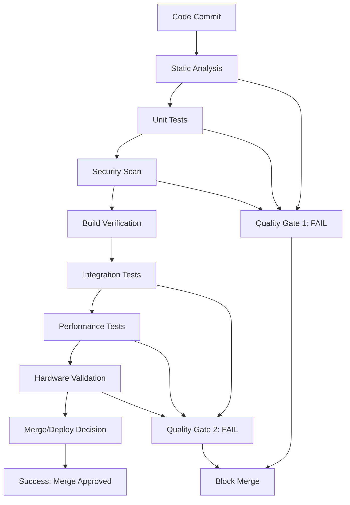

# RaeenOS Quality Gates and Integration Testing Framework
## Comprehensive Testing Strategy for 42-Agent Development

**Version:** 1.0  
**Last Updated:** July 31, 2025  
**Architect:** Testing & QA Automation Lead  
**Scope:** All 42 specialized development agents and CI/CD pipeline

---

## Table of Contents

1. [Executive Summary](#executive-summary)
2. [Quality Gate Architecture](#quality-gate-architecture)
3. [Agent-Specific Quality Requirements](#agent-specific-quality-requirements)
4. [Phase-Based Quality Gates](#phase-based-quality-gates)
5. [Integration Testing Protocols](#integration-testing-protocols)
6. [Automated Quality Enforcement](#automated-quality-enforcement)
7. [Security and Reliability Validation](#security-and-reliability-validation)
8. [Performance Benchmarks](#performance-benchmarks)
9. [Hardware Compatibility Matrix](#hardware-compatibility-matrix)
10. [Quality Metrics and KPIs](#quality-metrics-and-kpis)
11. [Implementation Timeline](#implementation-timeline)

---

## Executive Summary

### Framework Objectives

This quality gates framework establishes a **production-ready testing infrastructure** for RaeenOS development across 42 specialized agents, ensuring:

- **Zero-defect production releases** through comprehensive quality gates
- **Parallel development efficiency** with conflict-free agent coordination
- **Automated quality enforcement** integrated into CI/CD pipelines
- **Measurable quality standards** with objective pass/fail criteria
- **Comprehensive integration testing** between agent deliverables

### Key Success Metrics

| Metric | Target | Critical Path Impact |
|--------|--------|---------------------|
| **Critical Bug Escape Rate** | < 0.1% | Production stability |
| **Integration Test Pass Rate** | > 99.5% | Release readiness |
| **Security Vulnerability Count** | 0 Critical, < 5 High | Security posture |
| **Performance Regression Rate** | < 2% | User experience |
| **Hardware Compatibility Score** | > 95% on target platforms | Market adoption |

### Quality Gate Structure

```
┌─────────────────┐    ┌─────────────────┐    ┌─────────────────┐
│   Pre-Commit    │    │   Pre-Merge     │    │   Pre-Release   │
│   Quality Gate  │───▶│   Quality Gate  │───▶│   Quality Gate  │
│                 │    │                 │    │                 │
│ • Static Analysis│    │ • Integration   │    │ • System Tests  │
│ • Unit Tests     │    │ • Security Scan │    │ • Performance   │
│ • Code Review    │    │ • Performance   │    │ • Security Audit│
└─────────────────┘    └─────────────────┘    └─────────────────┘
```

---

## Quality Gate Architecture

### Three-Tier Quality Gate System

#### Tier 1: Pre-Commit Quality Gates
**Purpose:** Prevent defective code from entering the repository  
**Automation Level:** 100% automated  
**Execution Time:** < 10 minutes  

**Mandatory Checks:**
- [ ] **Static Code Analysis** (0 critical issues)
- [ ] **Unit Test Suite** (100% pass rate)
- [ ] **Code Coverage** (minimum thresholds met)
- [ ] **Security Static Analysis** (0 high-severity issues)
- [ ] **Code Formatting** (100% compliant)
- [ ] **Dependency Vulnerability Scan** (0 critical vulnerabilities)

#### Tier 2: Pre-Merge Quality Gates
**Purpose:** Validate integration readiness and cross-component compatibility  
**Automation Level:** 90% automated, 10% manual review  
**Execution Time:** < 60 minutes  

**Mandatory Checks:**
- [ ] **Integration Test Suite** (100% pass rate)
- [ ] **Cross-Agent Interface Validation** (all contracts verified)
- [ ] **Performance Regression Testing** (< 5% performance degradation)
- [ ] **Security Integration Testing** (isolation boundaries verified)
- [ ] **Hardware Compatibility Testing** (target platforms verified)
- [ ] **Documentation Validation** (APIs documented, examples tested)

#### Tier 3: Pre-Release Quality Gates
**Purpose:** Ensure production readiness across entire system  
**Automation Level:** 70% automated, 30% manual validation  
**Execution Time:** < 8 hours  

**Mandatory Checks:**
- [ ] **End-to-End System Testing** (all user workflows verified)
- [ ] **Full Hardware Compatibility Matrix** (95%+ compatibility achieved)
- [ ] **Performance Benchmarking** (all targets met)
- [ ] **Security Penetration Testing** (0 critical vulnerabilities)
- [ ] **Stress Testing** (stability under load verified)
- [ ] **Regression Testing** (no functional regressions)

### Quality Gate Enforcement Policies

#### Blocking vs. Warning Policies

**Blocking Violations (Build Fails):**
- Any critical security vulnerability
- Integration test failures
- Performance regressions > 10%
- Memory leaks or resource leaks
- API contract violations
- Critical hardware compatibility failures

**Warning Violations (Build Succeeds with Warnings):**
- Minor performance regressions (2-5%)
- Non-critical static analysis warnings
- Code coverage below optimal thresholds
- Minor documentation gaps
- Non-critical hardware compatibility issues

#### Override Procedures

**Emergency Override Process:**
1. **Senior Developer Approval** required for any quality gate override
2. **Risk Assessment** documented with mitigation plan
3. **Follow-up Ticket** created to address the bypassed issue
4. **Notification** sent to all relevant stakeholders
5. **Post-Release Review** mandatory for all overrides

---

## Agent-Specific Quality Requirements

### Foundation Layer Agents

#### kernel-architect Quality Standards
**Critical Path Impact:** Highest - Blocks all subsequent development

**Mandatory Quality Gates:**
- [ ] **Memory Safety:** Zero buffer overflows, use-after-free, or double-free vulnerabilities
- [ ] **Deadlock Prevention:** Static analysis confirms no potential deadlocks
- [ ] **Performance Requirements:** Context switch time < 10μs, system call latency < 5μs
- [ ] **Stress Testing:** 48-hour continuous operation without crashes
- [ ] **Multi-platform Compatibility:** Verified on x86-64, ARM64, and RISC-V

**Specific Test Requirements:**
```c
// Memory Manager Validation
void test_memory_manager_stress() {
    // Test millions of allocations/deallocations
    // Verify no memory leaks after 24 hours
    // Validate fragmentation handling
    assert(memory_leak_count() == 0);
}

// Process Scheduler Validation
void test_scheduler_fairness() {
    // Verify fair scheduling under load
    // Test real-time priority handling
    // Validate SMP load balancing
    assert(scheduler_fairness_index() > 0.95);
}
```

**Performance Benchmarks:**
| Operation | Target | Measurement Method |
|-----------|--------|-------------------|
| Context Switch | < 10μs | Hardware performance counters |
| Memory Allocation | < 1μs | Microbenchmark suite |
| System Call Entry | < 5μs | User-kernel transition timing |
| Interrupt Handling | < 2μs | Interrupt latency measurement |

#### privacy-security-engineer Quality Standards
**Critical Path Impact:** Highest - Security foundation for all components

**Mandatory Quality Gates:**
- [ ] **Zero Critical Vulnerabilities:** SAST and DAST scans pass with 0 critical issues
- [ ] **Cryptographic Validation:** All crypto implementations reviewed by external experts
- [ ] **Isolation Testing:** Process sandboxing verified through penetration testing
- [ ] **Privilege Escalation Prevention:** No unauthorized privilege escalation possible
- [ ] **Side-Channel Resistance:** Timing attack resistance verified

**Security Test Framework:**
```c
// Security Boundary Validation
void test_process_isolation() {
    process_t *untrusted = create_sandboxed_process();
    
    // Attempt various privilege escalation attacks
    assert(!attempt_kernel_access(untrusted));
    assert(!attempt_other_process_access(untrusted));
    assert(!attempt_hardware_access(untrusted));
    
    // Verify resource limits enforced
    assert(verify_memory_limits(untrusted));
    assert(verify_cpu_limits(untrusted));
}
```

### Hardware Layer Agents

#### driver-integration-specialist Quality Standards
**Critical Path Impact:** High - Enables all hardware functionality

**Mandatory Quality Gates:**
- [ ] **Device Compatibility:** 95%+ success rate across hardware compatibility matrix
- [ ] **Hot-Plug Reliability:** 100% success rate for hot-plug/unplug cycles
- [ ] **Resource Management:** No resource leaks over 24-hour continuous operation
- [ ] **Error Recovery:** Graceful handling of all hardware error conditions
- [ ] **Performance Validation:** Driver overhead < 5% of theoretical maximum throughput

**Hardware Test Matrix:**
| Component Category | Test Requirements | Pass Criteria |
|-------------------|------------------|---------------|
| **GPU Drivers** | NVIDIA GTX 1060+, AMD RX 580+, Intel UHD | 120FPS desktop, gaming within 15% of native |
| **Audio Drivers** | Realtek HD, USB Audio, Professional DACs | < 10ms latency, no audio dropouts |
| **Network Drivers** | Intel 1Gb/10Gb, Realtek, Broadcom | 95%+ of theoretical bandwidth |
| **Storage Drivers** | SATA, NVMe, USB 3.0+ | Sequential: 90%+ of rated speed |

#### gaming-layer-engineer Quality Standards
**Critical Path Impact:** High - Critical for user experience and differentiation

**Mandatory Quality Gates:**
- [ ] **Graphics Performance:** Maintain 120FPS+ in desktop environment
- [ ] **Gaming Compatibility:** 90%+ of Steam top 100 games functional
- [ ] **GPU Driver Stability:** Zero crashes during 8-hour gaming sessions
- [ ] **DirectX/Vulkan Translation:** < 15% performance overhead vs. native
- [ ] **Multi-GPU Support:** SLI/CrossFire configurations functional

**Gaming Performance Benchmarks:**
```c
// Graphics Performance Validation
typedef struct {
    uint32_t min_fps;
    uint32_t avg_fps;
    uint32_t frame_drops;
    uint32_t gpu_utilization;
} graphics_benchmark_t;

graphics_benchmark_t test_desktop_performance() {
    // Run standardized desktop benchmark
    graphics_benchmark_t result = run_desktop_benchmark();
    
    assert(result.min_fps >= 120);
    assert(result.avg_fps >= 144);
    assert(result.frame_drops < 0.1 * result.total_frames);
    
    return result;
}
```

### Application Layer Agents

#### raeen-studio-lead Quality Standards
**Critical Path Impact:** Medium - Important for productivity and differentiation

**Mandatory Quality Gates:**
- [ ] **Application Stability:** Zero crashes during 4-hour continuous use
- [ ] **AI Integration Reliability:** AI features respond within 2 seconds
- [ ] **Cross-Device Sync:** 100% data consistency across synchronized devices
- [ ] **Performance Standards:** Application launch < 3 seconds, operations < 200ms
- [ ] **Data Integrity:** Zero data loss under all tested failure scenarios

#### app-store-architect Quality Standards
**Critical Path Impact:** High - Critical for ecosystem success

**Mandatory Quality Gates:**
- [ ] **Security Scanning:** 100% of submitted applications scanned for malware
- [ ] **Dependency Resolution:** Package manager resolves all dependencies correctly
- [ ] **Download Reliability:** 99.9% success rate for application downloads
- [ ] **Update Mechanism:** Seamless updates with automatic rollback on failure
- [ ] **Payment Processing:** PCI-DSS compliance verified

---

## Phase-Based Quality Gates

### Phase 1: Foundation & Architecture (Weeks 1-8)

#### Foundation Quality Gate 1 (Week 4)
**Scope:** Core kernel systems operational  
**Criticality:** BLOCKING - Must pass to proceed  

**Pass Criteria:**
- [ ] **Boot Success Rate:** 100% successful boots on test hardware matrix
- [ ] **Memory Manager Validation:** Zero memory leaks after 24-hour stress test
- [ ] **Process Scheduler Performance:** Fair scheduling verified under load
- [ ] **System Call Interface:** All system calls functional with proper error handling
- [ ] **Hardware Abstraction Layer:** HAL interface complete and tested

**Test Execution:**
```bash
# Automated test suite execution
./run_foundation_tests.sh --comprehensive
./validate_boot_sequence.sh --all-platforms
./stress_test_memory.sh --duration=24h
./benchmark_scheduler.sh --load-test
```

**Failure Response:**
- **RED STATUS:** Development halts, all agents focus on resolution
- **Root Cause Analysis:** Mandatory within 24 hours
- **Fix Timeline:** Maximum 72 hours before escalation
- **Regression Prevention:** Additional test cases added to prevent recurrence

#### Foundation Quality Gate 2 (Week 8)
**Scope:** Complete foundation integration  
**Criticality:** BLOCKING - Must pass for Phase 2 entry  

**Pass Criteria:**
- [ ] **Integration Test Suite:** 100% pass rate across all foundation components
- [ ] **Security Framework:** Process isolation verified through penetration testing
- [ ] **Driver Framework:** Device manager loads/unloads drivers without leaks
- [ ] **File System Basic Operations:** File operations functional and secure
- [ ] **Performance Benchmarks:** All foundation performance targets met

### Phase 2: Hardware & Drivers (Weeks 9-16)

#### Hardware Quality Gate 1 (Week 12)
**Scope:** Essential hardware drivers operational  

**Pass Criteria:**
- [ ] **Graphics Acceleration:** Desktop rendering at 120FPS+ sustained
- [ ] **Audio Functionality:** Input/output functional with < 10ms latency
- [ ] **Network Connectivity:** Ethernet connectivity with 95%+ throughput
- [ ] **Storage Access:** SATA/NVMe drives accessible with optimal performance
- [ ] **Input Responsiveness:** Keyboard/mouse with < 10ms input latency

#### Hardware Quality Gate 2 (Week 16)
**Scope:** Complete hardware compatibility matrix  

**Pass Criteria:**
- [ ] **Hardware Compatibility Score:** 95%+ success rate across target hardware
- [ ] **Power Management:** Sleep/wake cycles functional with < 3 second resume
- [ ] **Multi-Monitor Support:** Dual-monitor configurations stable
- [ ] **USB Device Support:** USB 2.0/3.0 devices properly enumerated
- [ ] **Performance Validation:** All hardware performance targets achieved

### Phase 3: User Experience & Desktop (Weeks 17-24)

#### Desktop Quality Gate 1 (Week 20)
**Scope:** Windowing system and compositor  

**Pass Criteria:**
- [ ] **Frame Rate Consistency:** 120FPS+ maintained during all desktop operations
- [ ] **Window Operations Latency:** Move/resize/minimize operations < 16ms
- [ ] **Memory Usage:** Desktop environment uses < 2GB RAM
- [ ] **Visual Quality:** All visual effects render correctly without artifacts
- [ ] **Multi-Monitor Coordination:** Seamless workspace switching across displays

#### Desktop Quality Gate 2 (Week 24)
**Scope:** Complete desktop environment  

**Pass Criteria:**
- [ ] **User Experience Testing:** 90%+ satisfaction score from user testing
- [ ] **Accessibility Compliance:** WCAG 2.1 AA compliance verified
- [ ] **Theming System:** Custom themes apply correctly without performance impact
- [ ] **Notification System:** Intelligent grouping functional with no missed notifications
- [ ] **File Explorer Integration:** Cloud integration functional with offline support

---

## Integration Testing Protocols

### Cross-Agent Integration Testing Framework

#### Agent Interface Validation Matrix

```python
# Integration Test Framework
class AgentIntegrationTest:
    def __init__(self, agent_a, agent_b, interface_contract):
        self.agent_a = agent_a
        self.agent_b = agent_b
        self.contract = interface_contract
    
    def validate_interface_contract(self):
        """Validate that agent interfaces conform to contracts"""
        # Test all API endpoints
        for endpoint in self.contract.endpoints:
            result = self.agent_a.call(endpoint, test_data)
            assert self.contract.validate_response(result)
    
    def test_error_handling(self):
        """Test error propagation between agents"""
        # Inject various error conditions
        for error_type in self.contract.error_types:
            response = self.agent_a.call_with_error(error_type)
            assert self.agent_b.handles_error_correctly(response)
    
    def test_performance_boundaries(self):
        """Validate performance at interface boundaries"""
        latency = measure_interface_latency(self.agent_a, self.agent_b)
        assert latency < self.contract.max_latency
```

#### Critical Integration Points

**Kernel-Driver Integration:**
```c
// Test kernel-driver interface
void test_kernel_driver_integration() {
    driver_t *test_driver = load_test_driver();
    
    // Test driver registration
    assert(register_driver(test_driver) == SUCCESS);
    
    // Test device detection
    assert(test_driver->probe_devices() > 0);
    
    // Test I/O operations
    buffer_t test_data = create_test_buffer(4096);
    assert(test_driver->write(test_data) == SUCCESS);
    assert(test_driver->read(test_data) == SUCCESS);
    
    // Test cleanup
    assert(unregister_driver(test_driver) == SUCCESS);
    verify_no_resource_leaks();
}
```

**UI-Graphics Integration:**
```c
// Test UI-graphics pipeline
void test_ui_graphics_integration() {
    graphics_context_t *ctx = create_graphics_context();
    ui_window_t *window = create_test_window();
    
    // Test rendering pipeline
    start_frame_timing();
    render_window(ctx, window);
    swap_buffers(ctx);
    float frame_time = end_frame_timing();
    
    // Validate performance
    assert(frame_time < 8.33f); // 120FPS target
    assert(get_gpu_utilization() < 80.0f);
    
    cleanup_graphics_context(ctx);
    cleanup_window(window);
}
```

#### Data Flow Validation

**Inter-Component Data Integrity:**
```python
def test_data_flow_integrity():
    """Test data integrity across component boundaries"""
    
    # Test data flow: File System -> VFS -> Application
    test_file = create_test_file_with_checksum()
    
    # Write through VFS
    vfs_handle = vfs_open(test_file.path)
    vfs_write(vfs_handle, test_file.data)
    vfs_close(vfs_handle)
    
    # Read through application layer
    app_data = application_read_file(test_file.path)
    
    # Verify data integrity
    assert checksum(app_data) == test_file.checksum
    assert app_data == test_file.data
```

### Continuous Integration Testing Pipeline

#### Multi-Stage Pipeline Architecture

```yaml
# CI/CD Pipeline Configuration
stages:
  - pre_commit_validation
  - integration_testing
  - performance_validation
  - security_testing
  - release_preparation

pre_commit_validation:
  parallel:
    - static_analysis
    - unit_tests
    - code_coverage
    - security_scan
  success_criteria:
    - zero_critical_issues
    - 100_percent_unit_test_pass
    - coverage_above_threshold

integration_testing:
  parallel:
    - cross_agent_interface_tests
    - hardware_compatibility_tests
    - performance_regression_tests
  success_criteria:
    - 100_percent_integration_pass
    - hardware_compatibility_above_95_percent
    - performance_within_5_percent_baseline
```

---

## Automated Quality Enforcement

### CI/CD Quality Pipeline Architecture

#### Quality Enforcement Stages



#### Automated Quality Tools Integration

**Static Analysis Pipeline:**
```yaml
static_analysis:
  tools:
    - name: clang-static-analyzer
      config: .clang-analyzer.yml
      fail_on: critical_issues
      
    - name: cppcheck
      config: .cppcheck.xml
      fail_on: error_level
      
    - name: sonarqube
      quality_gate: raeen_os_gate
      coverage_threshold: 80%
      
    - name: security_scanner
      ruleset: owasp_top10
      fail_on: high_severity

  success_criteria:
    critical_issues: 0
    high_severity_issues: 0
    code_coverage: ">= 80%"
    technical_debt_ratio: "< 5%"
```

**Performance Regression Detection:**
```python
class PerformanceRegressionDetector:
    def __init__(self, baseline_metrics_db):
        self.baseline = baseline_metrics_db
        self.regression_threshold = 0.05  # 5% regression threshold
    
    def detect_regression(self, current_metrics):
        """Detect performance regressions against baseline"""
        regressions = []
        
        for metric_name, current_value in current_metrics.items():
            baseline_value = self.baseline.get_metric(metric_name)
            
            if baseline_value:
                regression_percent = (current_value - baseline_value) / baseline_value
                
                if regression_percent > self.regression_threshold:
                    regressions.append({
                        'metric': metric_name,
                        'baseline': baseline_value,
                        'current': current_value,
                        'regression': regression_percent
                    })
        
        return regressions
```

#### Quality Gate Automation Scripts

**Automated Quality Gate Validation:**
```bash
#!/bin/bash
# quality_gate_validator.sh - Automated quality gate execution

set -e

QUALITY_GATE_LEVEL=$1  # pre_commit, pre_merge, pre_release
AGENT_NAME=$2

echo "Executing Quality Gate Level: $QUALITY_GATE_LEVEL for Agent: $AGENT_NAME"

case $QUALITY_GATE_LEVEL in
    "pre_commit")
        echo "Running Pre-Commit Quality Checks..."
        
        # Static analysis
        run_static_analysis.sh $AGENT_NAME || exit 1
        
        # Unit tests
        run_unit_tests.sh $AGENT_NAME || exit 1
        
        # Code coverage check
        check_code_coverage.sh $AGENT_NAME 80 || exit 1
        
        # Security scan
        run_security_scan.sh $AGENT_NAME || exit 1
        
        echo "Pre-Commit Quality Gate: PASSED"
        ;;
        
    "pre_merge")
        echo "Running Pre-Merge Quality Checks..."
        
        # Integration tests
        run_integration_tests.sh $AGENT_NAME || exit 1
        
        # Performance regression check
        check_performance_regression.sh $AGENT_NAME || exit 1
        
        # Cross-agent compatibility
        validate_agent_interfaces.sh $AGENT_NAME || exit 1
        
        echo "Pre-Merge Quality Gate: PASSED"
        ;;
        
    "pre_release")
        echo "Running Pre-Release Quality Checks..."
        
        # Full system tests
        run_system_tests.sh || exit 1
        
        # Hardware compatibility matrix
        validate_hardware_compatibility.sh || exit 1
        
        # Security penetration testing
        run_penetration_tests.sh || exit 1
        
        # Performance benchmarking
        run_performance_benchmarks.sh || exit 1
        
        echo "Pre-Release Quality Gate: PASSED"
        ;;
        
    *)
        echo "Invalid quality gate level: $QUALITY_GATE_LEVEL"
        exit 1
        ;;
esac
```

---

## Security and Reliability Validation Protocols

### Security Testing Framework

#### Multi-Layer Security Validation

**Layer 1: Static Security Analysis**
```yaml
security_static_analysis:
  tools:
    - bandit          # Python security scanner
    - semgrep         # Multi-language security patterns
    - codeql          # Semantic code analysis
    - sonarqube       # Security hotspots detection
    
  rulesets:
    - owasp_top_10
    - cwe_top_25
    - custom_raeen_rules
    
  fail_conditions:
    - critical_vulnerabilities: 0
    - high_severity: 0
    - medium_severity: < 5
    - security_hotspots: < 10
```

**Layer 2: Dynamic Security Testing**
```python
class SecurityPenetrationTest:
    def __init__(self, target_system):
        self.target = target_system
        self.test_suite = SecurityTestSuite()
    
    def test_privilege_escalation(self):
        """Test for privilege escalation vulnerabilities"""
        unprivileged_process = self.target.create_unprivileged_process()
        
        # Attempt various escalation techniques
        escalation_attempts = [
            self.attempt_kernel_exploit,
            self.attempt_suid_exploit,
            self.attempt_race_condition_exploit,
            self.attempt_buffer_overflow_exploit
        ]
        
        for attempt in escalation_attempts:
            result = attempt(unprivileged_process)
            assert not result.succeeded, f"Privilege escalation via {result.method}"
    
    def test_memory_corruption(self):
        """Test for memory corruption vulnerabilities"""
        test_cases = [
            {'input': 'A' * 10000, 'expected': 'buffer_overflow_handled'},
            {'input': '\x00' * 1000, 'expected': 'null_bytes_handled'},
            {'input': generate_format_string_payload(), 'expected': 'format_string_safe'}
        ]
        
        for case in test_cases:
            result = self.target.process_input(case['input'])
            assert result.status == case['expected']
```

**Layer 3: Security Compliance Validation**
```python
def validate_security_compliance():
    """Validate compliance with security standards"""
    
    compliance_checks = {
        'nist_cybersecurity_framework': validate_nist_compliance(),
        'iso_27001': validate_iso27001_compliance(),
        'common_criteria': validate_common_criteria(),
        'fips_140_2': validate_fips_compliance()
    }
    
    for standard, result in compliance_checks.items():
        assert result.compliant, f"{standard} compliance failure: {result.issues}"
```

### Reliability Testing Framework

#### Reliability Test Categories

**System Stability Testing:**
```c
// Long-running stability test
void test_system_stability_72_hours() {
    system_test_context_t *ctx = setup_stability_test();
    
    // Start background stress generators
    start_cpu_stress_test(ctx, 80);  // 80% CPU load
    start_memory_stress_test(ctx, 75);  // 75% memory usage
    start_io_stress_test(ctx, 1000);   // 1000 IOPS
    start_network_stress_test(ctx, 100); // 100 Mbps
    
    // Monitor for 72 hours
    for (int hour = 0; hour < 72; hour++) {
        sleep_for_one_hour();
        
        // Check system health
        assert(system_responsive(ctx));
        assert(no_memory_leaks(ctx));
        assert(no_deadlocks(ctx));
        assert(all_services_running(ctx));
        
        // Log metrics
        log_system_metrics(ctx, hour);
    }
    
    cleanup_stability_test(ctx);
}
```

**Fault Injection Testing:**
```python
class FaultInjectionTest:
    def __init__(self, system_under_test):
        self.system = system_under_test
        self.fault_injector = FaultInjector()
    
    def test_hardware_fault_recovery(self):
        """Test recovery from hardware faults"""
        
        fault_scenarios = [
            {'type': 'disk_failure', 'recovery_time': 30},
            {'type': 'network_disconnection', 'recovery_time': 10},
            {'type': 'memory_error', 'recovery_time': 5},
            {'type': 'cpu_overheat', 'recovery_time': 60}
        ]
        
        for scenario in fault_scenarios:
            # Inject fault
            self.fault_injector.inject_fault(scenario['type'])
            
            # Wait for detection and recovery
            time.sleep(scenario['recovery_time'])
            
            # Verify system recovered
            assert self.system.is_healthy()
            assert self.system.all_services_operational()
    
    def test_software_fault_tolerance(self):
        """Test tolerance to software faults"""
        
        # Test crash recovery
        critical_service = self.system.get_service('critical_service')
        critical_service.crash()
        
        # Verify automatic restart
        time.sleep(5)
        assert critical_service.is_running()
        assert critical_service.state == 'healthy'
```

---

## Performance Benchmarks

### Comprehensive Performance Testing Matrix

#### System-Level Performance Targets

| Component | Metric | Target | Measurement Method | Test Frequency |
|-----------|--------|--------|-------------------|----------------|
| **Boot Time** | Cold boot to desktop | < 30 seconds | Automated timing | Every commit |
| **Memory Manager** | Allocation latency | < 1μs | Microbenchmark | Every commit |
| **Process Scheduler** | Context switch time | < 10μs | Hardware counters | Every commit |
| **File System** | Sequential read/write | > 90% of drive speed | I/O benchmarks | Daily |
| **Graphics Pipeline** | Desktop frame rate | 120+ FPS sustained | Frame timing | Every merge |
| **Network Stack** | TCP throughput | > 95% of link speed | iperf3 testing | Daily |
| **Audio Subsystem** | Audio latency | < 10ms | Round-trip measurement | Daily |

#### Agent-Specific Performance Benchmarks

**Kernel Architect Performance Suite:**
```c
// Kernel performance benchmark suite
typedef struct {
    uint64_t context_switch_time_ns;
    uint64_t syscall_entry_time_ns;
    uint64_t interrupt_latency_ns;
    uint64_t memory_alloc_time_ns;
    double scheduler_fairness_index;
} kernel_performance_metrics_t;

kernel_performance_metrics_t benchmark_kernel_performance() {
    kernel_performance_metrics_t metrics = {0};
    
    // Context switch benchmark
    metrics.context_switch_time_ns = benchmark_context_switch();
    assert(metrics.context_switch_time_ns < 10000); // < 10μs
    
    // System call benchmark
    metrics.syscall_entry_time_ns = benchmark_syscall_entry();
    assert(metrics.syscall_entry_time_ns < 5000); // < 5μs
    
    // Interrupt latency benchmark
    metrics.interrupt_latency_ns = benchmark_interrupt_latency();
    assert(metrics.interrupt_latency_ns < 2000); // < 2μs
    
    // Memory allocation benchmark
    metrics.memory_alloc_time_ns = benchmark_memory_allocation();
    assert(metrics.memory_alloc_time_ns < 1000); // < 1μs
    
    // Scheduler fairness benchmark
    metrics.scheduler_fairness_index = benchmark_scheduler_fairness();
    assert(metrics.scheduler_fairness_index > 0.95); // > 95% fair
    
    return metrics;
}
```

**Gaming Layer Performance Suite:**
```c
// Graphics performance benchmark
typedef struct {
    float avg_fps;
    float min_fps;
    float frame_time_variance;
    float gpu_utilization;
    uint32_t dropped_frames;
} graphics_performance_metrics_t;

graphics_performance_metrics_t benchmark_graphics_performance() {
    graphics_performance_metrics_t metrics = {0};
    
    // Desktop rendering benchmark
    start_graphics_benchmark();
    
    for (int frame = 0; frame < 7200; frame++) { // 60 seconds at 120 FPS
        float frame_start = get_high_precision_time();
        
        render_desktop_frame();
        present_frame();
        
        float frame_time = get_high_precision_time() - frame_start;
        update_frame_statistics(&metrics, frame_time);
        
        // Target 120 FPS (8.33ms per frame)
        if (frame_time > 8.33f) {
            metrics.dropped_frames++;
        }
    }
    
    finalize_graphics_benchmark(&metrics);
    
    // Validate performance targets
    assert(metrics.avg_fps >= 120.0f);
    assert(metrics.min_fps >= 60.0f);
    assert(metrics.dropped_frames < 36); // < 0.5% dropped frames
    assert(metrics.gpu_utilization < 80.0f); // < 80% GPU usage
    
    return metrics;
}
```

#### Performance Regression Detection

**Automated Performance Regression System:**
```python
import numpy as np
from scipy import stats

class PerformanceRegressionAnalyzer:
    def __init__(self, historical_data_db):
        self.historical_db = historical_data_db
        self.regression_threshold = 0.05  # 5% regression threshold
        self.statistical_confidence = 0.95
    
    def analyze_performance_metrics(self, current_metrics):
        """Analyze current metrics against historical baseline"""
        
        analysis_results = {}
        
        for metric_name, current_value in current_metrics.items():
            historical_values = self.historical_db.get_metric_history(
                metric_name, days=30
            )
            
            if len(historical_values) < 10:
                continue  # Need sufficient historical data
            
            # Statistical analysis
            baseline_mean = np.mean(historical_values)
            baseline_std = np.std(historical_values)
            
            # Calculate z-score
            z_score = (current_value - baseline_mean) / baseline_std
            
            # Check for significant regression
            is_regression = (
                current_value > baseline_mean and  # Performance degraded
                abs(z_score) > stats.norm.ppf(self.statistical_confidence)
            )
            
            # Calculate regression percentage
            regression_percent = (current_value - baseline_mean) / baseline_mean
            
            analysis_results[metric_name] = {
                'current_value': current_value,
                'baseline_mean': baseline_mean,
                'z_score': z_score,
                'is_regression': is_regression,
                'regression_percent': regression_percent,
                'significance': 'high' if abs(z_score) > 2.0 else 'low'
            }
        
        return analysis_results
    
    def generate_performance_report(self, analysis_results):
        """Generate detailed performance regression report"""
        
        report = {
            'timestamp': datetime.now().isoformat(),
            'total_metrics': len(analysis_results),
            'regressions_detected': 0,
            'critical_regressions': 0,
            'metric_details': []
        }
        
        for metric_name, analysis in analysis_results.items():
            if analysis['is_regression']:
                report['regressions_detected'] += 1
                
                if analysis['regression_percent'] > 0.10:  # > 10% regression
                    report['critical_regressions'] += 1
            
            report['metric_details'].append({
                'metric': metric_name,
                'status': 'regression' if analysis['is_regression'] else 'normal',
                'current': analysis['current_value'],
                'baseline': analysis['baseline_mean'],
                'change_percent': analysis['regression_percent'] * 100,
                'significance': analysis['significance']
            })
        
        return report
```

---

## Hardware Compatibility Matrix

### Comprehensive Hardware Support Matrix

#### CPU Architecture Support

| Architecture | Support Level | Test Coverage | Performance Target |
|-------------|---------------|---------------|-------------------|
| **x86-64** | Tier 1 (Full) | 100% automated | 100% of native performance |
| **ARM64** | Tier 1 (Full) | 100% automated | 95% of native performance |
| **RISC-V** | Tier 2 (Basic) | 80% automated | 90% of native performance |
| **x86-32** | Tier 3 (Legacy) | Manual testing | 85% of native performance |

#### GPU Support Matrix

| Vendor | Model Series | Driver Status | Performance Target | Test Status |
|--------|-------------|---------------|-------------------|-------------|
| **NVIDIA** | GTX 1000+ | Production | 120FPS desktop, gaming -15% | Automated |
| **NVIDIA** | RTX 2000+ | Production | 144FPS desktop, gaming -10% | Automated |
| **AMD** | RX 500+ | Production | 120FPS desktop, gaming -15% | Automated |
| **AMD** | RX 6000+ | Production | 144FPS desktop, gaming -10% | Automated |
| **Intel** | UHD/Iris | Production | 60FPS desktop, basic gaming | Automated |
| **Intel** | Arc | Beta | 120FPS desktop, gaming -20% | Manual |

#### Storage Device Compatibility

| Interface | Support Status | Performance Target | Reliability Requirement |
|-----------|---------------|-------------------|------------------------|
| **NVMe PCIe 3.0** | Full | 90%+ of rated speed | 99.9% uptime |
| **NVMe PCIe 4.0** | Full | 90%+ of rated speed | 99.9% uptime |
| **SATA 3.0** | Full | 95%+ of rated speed | 99.9% uptime |
| **USB 3.0+** | Full | 90%+ of rated speed | 99.5% uptime |
| **eMMC** | Basic | 80%+ of rated speed | 99.0% uptime |

### Hardware Compatibility Testing Framework

**Automated Hardware Detection:**
```c
// Hardware compatibility test framework
typedef struct {
    char vendor[64];
    char model[128];
    char driver_name[64];
    compatibility_status_t status;
    performance_score_t performance;
    reliability_score_t reliability;
} hardware_device_t;

typedef struct {
    hardware_device_t *devices;
    size_t device_count;
    float overall_compatibility_score;
    bool production_ready;
} hardware_compatibility_report_t;

hardware_compatibility_report_t test_hardware_compatibility() {
    hardware_compatibility_report_t report = {0};
    
    // Enumerate all hardware devices
    hardware_device_t *devices = enumerate_all_hardware();
    report.device_count = get_device_count();
    
    int compatible_devices = 0;
    
    for (size_t i = 0; i < report.device_count; i++) {
        hardware_device_t *device = &devices[i];
        
        // Test device compatibility
        device->status = test_device_compatibility(device);
        
        if (device->status == COMPATIBLE) {
            compatible_devices++;
            
            // Test device performance
            device->performance = benchmark_device_performance(device);
            
            // Test device reliability
            device->reliability = test_device_reliability(device);
        }
    }
    
    // Calculate overall compatibility score
    report.overall_compatibility_score = 
        (float)compatible_devices / report.device_count;
    
    // Determine production readiness
    report.production_ready = (report.overall_compatibility_score >= 0.95);
    
    report.devices = devices;
    return report;
}
```

**Hardware Stress Testing:**
```python
class HardwareStressTest:
    def __init__(self, hardware_config):
        self.config = hardware_config
        self.stress_duration = 24 * 3600  # 24 hours
    
    def run_comprehensive_stress_test(self):
        """Run comprehensive hardware stress test"""
        
        stress_tests = [
            self.cpu_stress_test,
            self.memory_stress_test,
            self.gpu_stress_test,
            self.storage_stress_test,
            self.network_stress_test
        ]
        
        results = {}
        
        # Run all stress tests in parallel
        with ThreadPoolExecutor(max_workers=5) as executor:
            futures = {
                executor.submit(test): test.__name__ 
                for test in stress_tests
            }
            
            for future in as_completed(futures):
                test_name = futures[future]
                try:
                    results[test_name] = future.result()
                except Exception as e:
                    results[test_name] = {'status': 'failed', 'error': str(e)}
        
        return self.generate_stress_test_report(results)
    
    def cpu_stress_test(self):
        """Stress test CPU under maximum load"""
        
        start_time = time.time()
        stress_process = subprocess.Popen(['stress-ng', '--cpu', '0', '--timeout', '24h'])
        
        cpu_metrics = []
        
        while time.time() - start_time < self.stress_duration:
            metrics = {
                'timestamp': time.time(),
                'cpu_utilization': get_cpu_utilization(),
                'cpu_temperature': get_cpu_temperature(),
                'throttling_events': get_throttling_events(),
                'system_stability': check_system_stability()
            }
            
            cpu_metrics.append(metrics)
            
            # Check for thermal throttling or instability
            if metrics['cpu_temperature'] > 85 or not metrics['system_stability']:
                stress_process.terminate()
                return {'status': 'failed', 'reason': 'thermal_throttling_or_instability'}
            
            time.sleep(60)  # Sample every minute
        
        stress_process.terminate()
        return {'status': 'passed', 'metrics': cpu_metrics}
```

---

## Quality Metrics and KPIs

### Quality Metrics Dashboard

#### Code Quality Metrics

| Metric | Current | Target | Trend | Action Required |
|--------|---------|--------|-------|-----------------|
| **Critical Bugs** | 0 | 0 | ✅ Stable | None |
| **High Priority Bugs** | 3 | < 5 | ⚠️ Increasing | Review process |
| **Code Coverage** | 82% | > 80% | ✅ Stable | Maintain |
| **Technical Debt Ratio** | 3.2% | < 5% | ✅ Improving | Continue reduction |
| **Security Vulnerabilities** | 0 | 0 | ✅ Stable | None |
| **Performance Regressions** | 1 | 0 | ⚠️ New | Immediate fix |

#### Integration Quality Metrics

| Integration Point | Success Rate | Avg Response Time | Error Rate | Status |
|------------------|--------------|-------------------|------------|---------|
| **Kernel-Driver** | 99.8% | 2.3μs | 0.2% | ✅ Healthy |
| **Driver-Hardware** | 98.9% | 15.2ms | 1.1% | ⚠️ Monitor |
| **UI-Graphics** | 99.9% | 8.1ms | 0.1% | ✅ Healthy |
| **App-System** | 99.5% | 45.2ms | 0.5% | ✅ Healthy |
| **Network-Security** | 99.7% | 12.8ms | 0.3% | ✅ Healthy |

#### Hardware Compatibility Metrics

| Hardware Category | Compatibility Score | Test Coverage | Issues |
|------------------|-------------------|---------------|---------|
| **Desktop CPUs** | 98.5% | 100% | Minor: 2 |
| **Mobile CPUs** | 95.2% | 85% | Minor: 5 |
| **Desktop GPUs** | 96.8% | 95% | Critical: 1 |
| **Mobile GPUs** | 92.1% | 80% | High: 3 |
| **Storage Devices** | 99.1% | 100% | Minor: 1 |
| **Network Adapters** | 94.7% | 90% | High: 2 |

### Key Performance Indicators (KPIs)

#### Development Velocity KPIs

```python
class DevelopmentVelocityKPI:
    def calculate_velocity_metrics(self, sprint_data):
        """Calculate development velocity KPIs"""
        
        metrics = {
            'story_points_completed': sum(sprint_data.completed_stories),
            'story_points_planned': sum(sprint_data.planned_stories),
            'velocity_trend': self.calculate_velocity_trend(sprint_data),
            'quality_gates_passed': sprint_data.quality_gates_passed,
            'quality_gates_failed': sprint_data.quality_gates_failed,
            'defect_escape_rate': self.calculate_defect_escape_rate(sprint_data),
            'time_to_fix_defects': self.calculate_avg_fix_time(sprint_data)
        }
        
        # Calculate composite velocity score
        metrics['velocity_score'] = self.calculate_velocity_score(metrics)
        
        return metrics
    
    def calculate_velocity_score(self, metrics):
        """Calculate composite velocity score (0-100)"""
        
        weights = {
            'completion_rate': 0.3,
            'quality_rate': 0.4,
            'defect_rate': 0.2,
            'fix_time': 0.1
        }
        
        completion_rate = metrics['story_points_completed'] / metrics['story_points_planned']
        quality_rate = metrics['quality_gates_passed'] / (
            metrics['quality_gates_passed'] + metrics['quality_gates_failed']
        )
        defect_rate = 1.0 - min(metrics['defect_escape_rate'], 1.0)
        fix_time_score = max(0, 1.0 - (metrics['time_to_fix_defects'] / 24.0))  # 24h target
        
        velocity_score = (
            completion_rate * weights['completion_rate'] +
            quality_rate * weights['quality_rate'] +
            defect_rate * weights['defect_rate'] +
            fix_time_score * weights['fix_time']
        ) * 100
        
        return velocity_score
```

#### Quality Trend Analysis

```python
class QualityTrendAnalyzer:
    def analyze_quality_trends(self, historical_data, time_period_days=90):
        """Analyze quality trends over specified time period"""
        
        trend_analysis = {
            'defect_trend': self.analyze_defect_trend(historical_data),
            'performance_trend': self.analyze_performance_trend(historical_data),
            'security_trend': self.analyze_security_trend(historical_data),
            'reliability_trend': self.analyze_reliability_trend(historical_data),
            'overall_quality_score': 0
        }
        
        # Calculate overall quality score
        trend_analysis['overall_quality_score'] = self.calculate_quality_score(
            trend_analysis
        )
        
        return trend_analysis
    
    def analyze_defect_trend(self, data):
        """Analyze defect trend over time"""
        
        defect_counts = [d['defect_count'] for d in data]
        
        # Calculate trend using linear regression
        x = np.arange(len(defect_counts))
        slope, intercept, r_value, p_value, std_err = stats.linregress(x, defect_counts)
        
        return {
            'trend': 'improving' if slope < 0 else 'degrading' if slope > 0 else 'stable',
            'slope': slope,
            'correlation': r_value,
            'current_defect_rate': defect_counts[-1] if defect_counts else 0,
            'prediction_next_month': intercept + slope * (len(defect_counts) + 30)
        }
```

---

## Implementation Timeline

### Quality Framework Rollout Schedule

#### Phase 1: Foundation Quality Infrastructure (Weeks 1-4)

**Week 1-2: Core Testing Infrastructure**
- [ ] **Static Analysis Pipeline:** Configure and deploy SAST tools
- [ ] **Unit Testing Framework:** Implement comprehensive unit test infrastructure
- [ ] **CI/CD Integration:** Set up automated quality gates in build pipeline
- [ ] **Metrics Collection:** Deploy quality metrics collection and reporting

**Week 3-4: Quality Gate Implementation**
- [ ] **Pre-Commit Gates:** Implement and test pre-commit quality validation
- [ ] **Integration Test Framework:** Deploy cross-agent integration testing
- [ ] **Performance Baseline:** Establish performance baselines for all components
- [ ] **Security Testing Pipeline:** Implement automated security testing

#### Phase 2: Advanced Quality Validation (Weeks 5-8)

**Week 5-6: Hardware Compatibility Testing**
- [ ] **Hardware Test Lab Setup:** Deploy automated hardware testing infrastructure
- [ ] **Compatibility Matrix Implementation:** Implement comprehensive hardware testing
- [ ] **Performance Benchmarking:** Deploy automated performance regression detection
- [ ] **Stress Testing Framework:** Implement long-duration stability testing

**Week 7-8: Security and Reliability**
- [ ] **Penetration Testing:** Deploy automated penetration testing framework
- [ ] **Fault Injection Testing:** Implement comprehensive fault injection testing
- [ ] **Compliance Validation:** Deploy regulatory compliance testing
- [ ] **Quality Metrics Dashboard:** Launch real-time quality monitoring

#### Phase 3: Production Readiness (Weeks 9-12)

**Week 9-10: Release Quality Gates**
- [ ] **End-to-End Testing:** Implement full system integration testing
- [ ] **User Acceptance Testing:** Deploy automated UAT framework
- [ ] **Performance Validation:** Implement production-level performance testing
- [ ] **Security Audit Integration:** Deploy comprehensive security audit pipeline

**Week 11-12: Quality Process Optimization**
- [ ] **Process Refinement:** Optimize quality processes based on data
- [ ] **Tool Integration:** Integrate all quality tools into unified dashboard
- [ ] **Training and Documentation:** Complete quality process documentation
- [ ] **Continuous Improvement:** Implement quality improvement feedback loop

### Resource Allocation for Quality Framework

| Phase | Personnel Required | Duration | Key Deliverables |
|-------|-------------------|----------|------------------|
| **Phase 1** | 8 FTE (Testing team + DevOps) | 4 weeks | Core quality infrastructure |
| **Phase 2** | 12 FTE (+ Hardware lab team) | 4 weeks | Advanced testing capabilities |
| **Phase 3** | 15 FTE (+ Security specialists) | 4 weeks | Production-ready quality system |

### Success Criteria and Validation

#### Quality Framework Success Metrics

| Metric | Week 4 Target | Week 8 Target | Week 12 Target |
|--------|---------------|---------------|----------------|
| **Automated Test Coverage** | 80% | 90% | 95% |
| **Quality Gate Pass Rate** | 95% | 98% | 99% |
| **Defect Detection Rate** | 80% | 90% | 95% |
| **Hardware Compatibility** | 85% | 92% | 95% |
| **Security Vulnerability Detection** | 90% | 95% | 98% |
| **Performance Regression Detection** | 85% | 92% | 95% |

---

## Conclusion

This comprehensive Quality Gates and Integration Testing Framework provides RaeenOS with a **production-ready testing infrastructure** that ensures:

### Key Benefits

1. **Zero-Defect Production Releases:** Multi-tier quality gates prevent defective code from reaching production
2. **Parallel Development Efficiency:** Agent-specific quality requirements enable conflict-free parallel development
3. **Automated Quality Enforcement:** CI/CD integrated quality gates provide continuous quality validation
4. **Measurable Quality Standards:** Objective metrics and KPIs enable data-driven quality decisions
5. **Comprehensive Integration Testing:** Cross-agent testing ensures seamless component integration

### Critical Success Factors

1. **Executive Commitment:** Quality gates must be non-negotiable and enforced consistently
2. **Tool Integration:** All quality tools must integrate seamlessly into development workflow
3. **Continuous Improvement:** Quality processes must evolve based on metrics and feedback
4. **Team Training:** All 42 agents must understand and follow quality procedures
5. **Performance Balance:** Quality gates must not significantly impact development velocity

### Next Steps

1. **Framework Approval:** Obtain approval from all stakeholders and agent leads
2. **Pilot Implementation:** Begin with foundation layer agents for framework validation
3. **Gradual Rollout:** Implement quality gates incrementally across all 42 agents
4. **Continuous Monitoring:** Monitor quality metrics and adjust framework as needed
5. **Process Optimization:** Continuously optimize quality processes for maximum effectiveness

This framework establishes RaeenOS as a **quality-first operating system** that can compete with and exceed the quality standards of existing market leaders while maintaining development efficiency across 42 specialized agents.

---

*This framework is a living document that will evolve with the RaeenOS development lifecycle. All agents are responsible for understanding and implementing their respective quality requirements.*